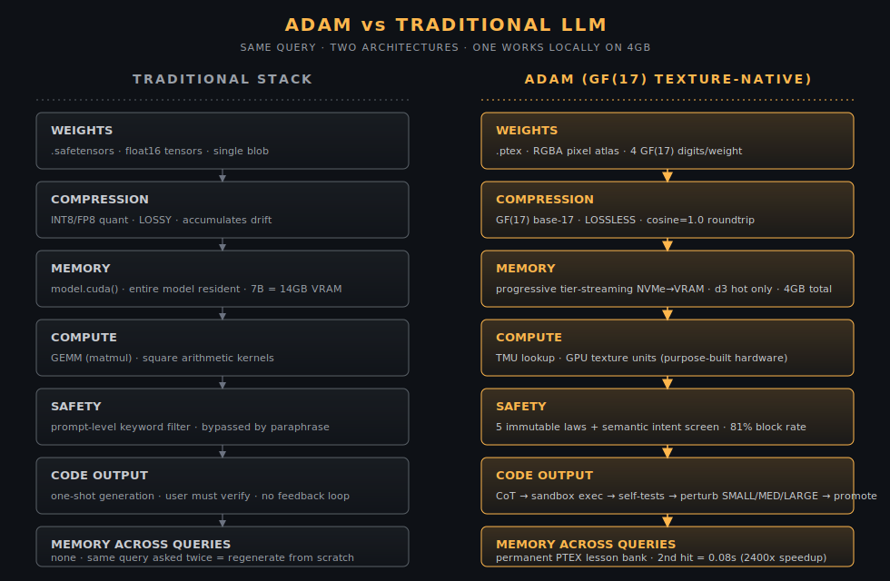

# Adam

**Texture-native, GF(17)-lossless, self-improving local AI assistant.** Runs in 4 GB VRAM. Drop-in Ollama + OpenAI replacement. Fully offline — no API keys, no telemetry.

<p align="center">
  
</p>

| | Traditional LLM | Adam |
|---|---|---|
| Weights | `.safetensors` float16 | `.ptex` GF(17) RGBA pixel atlas |
| Compression | INT8/FP8 lossy | GF(17) lossless (cosine=1.0 roundtrip) |
| Memory | Full VRAM load (7B = 14 GB) | Progressive tier-stream from NVMe (4 GB) |
| Compute | GEMM (matmul) | TMU lookups (GPU texture hardware) |
| Safety | Keyword filter | 5 immutable laws + semantic intent screen + write-protected source |
| Code output | One-shot generation | CoT → exec → self-test → perturb → promote |
| Corrections | Forgotten next turn | Closed-loop: verified, suppressed forever, recalled instantly — **never wrong twice** |
| Cross-query memory | None | Permanent PTEX lesson bank (instant tier0 recall on repeat) |
| Self-improvement | Frozen at training cut-off | 24/7 learning loop crawls + self-verifies + teaches through the same spine |

---

## Quick start

```bash
git clone https://github.com/Amnibro/Amni-Ai
cd Amni-Ai
python -m venv .venv && .venv/Scripts/activate   # (Mac/Linux: source .venv/bin/activate)
pip install -r requirements.txt
python install.py                 # one-shot: fetches the GF(17) bake, launches server, opens browser
```

Windows users: double-click `install.bat` instead of running `python install.py`.

Browser → **http://127.0.0.1:7700/** — a loading screen shows while Adam warms the GF(17) weights, then the unified UI appears (chat in the Rikku persona).

**[Full install guide →](docs/INSTALL.md)** · **[Tutorial: first 30 min →](docs/TUTORIAL.md)** · **[Landing page →](https://example.com/amni-ai)**

---

## What's in this repo

The complete source for a working Adam install (CC BY-NC 4.0).

- **`amni/serve/`** — FastAPI server, persona system, conversation store, the skill registry, the unified web UI (`unified_web.py`) + Jarvis UI (`jarvis_web.py`), Ollama-compatible `/api/*` and OpenAI-compatible `/v1/*` endpoints, MCP surface, and the **MemoryBus** closed-loop memory substrate (`memory_bus.py`)
- **`amni/inference/`** — Streaming chat wrapper, semantic LUT (lesson-bank lookup), AnswerLUT (ATEX exact recall), KB retriever, web crawler, debugger harness, tiered streaming loader, block-spec decoder
- **`amni/compute/`, `amni/core/`** — GF(17) 4-tier Reffelt decomposition, TMU dispatch, PrismTex codec
- **`amni/a1/`** — AsimovLayer (5 immutable laws), LawKeeper (file-integrity sealing), semantic intent screening, delta writer
- **`amni/training/`, `amni/model/`, `amni/learning/`** — training pipeline + model orchestration + GF(17) writer + integrity manifests
- **`amni/storage/`** — PTEX page reader/writer + texture catalog
- **`amni_kernels/`** — Rust kernels (prebuilt Windows `.pyd` included; Mac/Linux build via `maturin develop --release`)
- **`amni/seeds/`** — corpus modules — Adam ships smart out of the box (`--seed`)
- **`tests/`** — public-API probe tests, the memory-spine suites, the CoT-routing + self-consistency suites, and `run_security_suite.py` (46 hardening steps, 259 checks)
- **`scripts/amni_serve.py`** — server entry point with `--seed --cors --port` flags
- **`install.py`, `install.bat`, `install.sh`** — one-shot installers

---

## Use it as an Ollama / OpenAI drop-in

If you already use **Open WebUI**, **Continue.dev**, **Cursor**, **Cline**, **Aider**, or any client that speaks Ollama's or OpenAI's API, Adam slots in unchanged:

```bash
python scripts/amni_serve.py --seed --cors --port 11434
```

Point your client at `http://127.0.0.1:11434`. Adam exposes Ollama-shape `/api/*`, OpenAI-shape `/v1/*` (with tool-calling), and MCP `/mcp` — all on one port. It shows up as `adam:granite-gf17` plus aliases (`llama3.1`, `qwen2.5`, `gpt-4`, …) so clients with hardcoded model strings still resolve. CoT scaffolds, self-tests, lesson promotion, and persona switching all work — see [`docs/INSTALL.md § Path B`](docs/INSTALL.md#path-b--ollama-drop-in).

---

## What makes Adam different

**1. Closed-loop memory — never wrong twice.** When you correct Adam, the correction is *structural*, not a hint. The MemoryBus verifies every fact before storing it (verify-after-write), adds a corrected-away answer to a permanent anti-pattern set so it can never be returned again on any recall tier, and grounds future replies in the right answer — even when you ask a reworded question. A mistake fixed once is suppressed forever, locally and across the federation boundary.

**2. Sandbox-validated, self-improving code.** Adam doesn't just write Python — it runs the code in a subprocess sandbox, runs your test asserts, and if any fail it kicks into a trial-and-error loop (SMALL → MEDIUM → LARGE perturbations) until tests pass. Verified solutions get promoted into the lesson bank, so the next ask returns instantly. Code that ships has been *proven* to run.

**3. Verify before answering.** Beyond code, math questions answer by self-consistency (sample-and-vote majority) rather than a single greedy guess — the verify→correct loop is the default for verifiable tasks, the one lever proven to lift correctness without a bigger model.

**4. Self-improving lesson bank.** Every test-passing answer persists into a PTEX semantic LUT + exact-recall ATEX tier. Ask the same thing again and Adam returns the cached answer instantly (tier0, ~0 tokens). A 24/7 learning daemon crawls, self-verifies, and teaches Adam through the same disciplined spine — it gets better the more it (and you) use it.

**5. Multi-layer safety, structural not bolted-on.** Three stacked screens run before any LLM call (lexical regex, GF(17) hash patterns, semantic embedding screening). The 5 immutable Asimov laws are baked into the weights; the law + security-core source files are **write-protected** at the skill layer with sha256 tamper-detection; loaded lesson banks are audited for PII/injection/dangerous-code before they can seed the live store. See [`docs/SECURITY.md`](docs/SECURITY.md).

**6. Local. Always.** No API keys. No telemetry. No data leaves your machine. Your conversations live in `experiences/conversations/` on your disk. Delete them anytime. `.env` and secret files are deny-listed from every file skill.

---

## License

Adam is a two-license product. See [`NOTICE`](NOTICE) for the canonical statement.

**Original work by Amnibro** (serve layer, persona system, MemoryBus, semantic intent layer, runtime fetcher, seed corpora, docs, tests) — licensed under **CC BY-NC 4.0**. Free for personal, research, educational, and non-profit use. Commercial license: **the maintainer (via GitHub)**.

**Underlying base model weights** are derived from IBM's **Granite 4.1 3B**, licensed under **Apache License 2.0** ([`LICENSES/apache-2.0.txt`](LICENSES/apache-2.0.txt)). The Granite weights are losslessly re-encoded from fp16 to the Reffelt GF(17) RGBA pixel atlas representation (cosine-similarity 1.0 round-trip; no fine-tuning or lossy compression). The encoded weights are downloaded from HuggingFace (`amnibro/granite41-3b-gf17`) on first run and inherit Apache 2.0. *Granite* is a trademark of IBM; this product is not endorsed by or affiliated with IBM.

See [`LICENSE`](LICENSE) for the CC BY-NC 4.0 terms and [`LICENSES/apache-2.0.txt`](LICENSES/apache-2.0.txt) for the Apache 2.0 terms.

---

## Status

| | |
|---|---|
| Latest version | v6.11.16 (2026-05-30) |
| Base model | IBM Granite 4.1 3B → `amnibro/granite41-3b-gf17` (GF(17) lossless) |
| Memory spine | Closed-loop MemoryBus (S0–S5) complete + adversarially hardened |
| Security | 46 hardening steps, 259 checks (`tests/run_security_suite.py`) |
| UI | Unified UI at `/` with loading screen; Jarvis UI at `/jarvis`; HUD at `/hud` |
| APIs | Ollama `/api/*` + OpenAI `/v1/*` + MCP `/mcp`, one port |

Changelog: [`changelog.md`](changelog.md) tracks every version.
